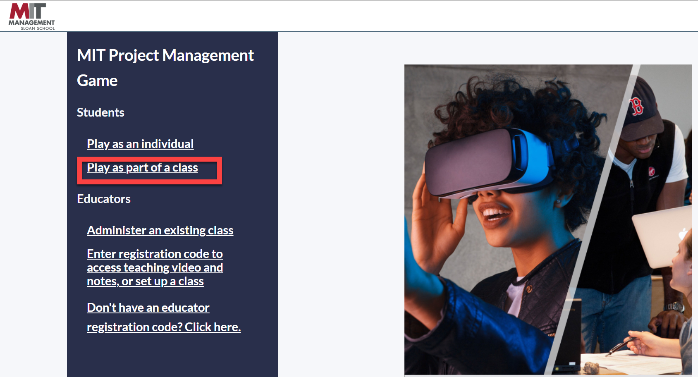

# Anleitung zur Projekt-Simulation MIT

## Anmeldung

1. Melden Sie sich über den Link "[Play as part of class](https://forio.com/app/mit/project-management/#/login)" mit der Gruppen-Email-Adresse (siehe ) und dem Passwort "HelloMIT".
2. Warten Sie die Instruktionen ab

## Aufgabe
Versuchen Sie das Projekt in der Gruppe "on Time on Budget" erfolgreich zu verwalten.

